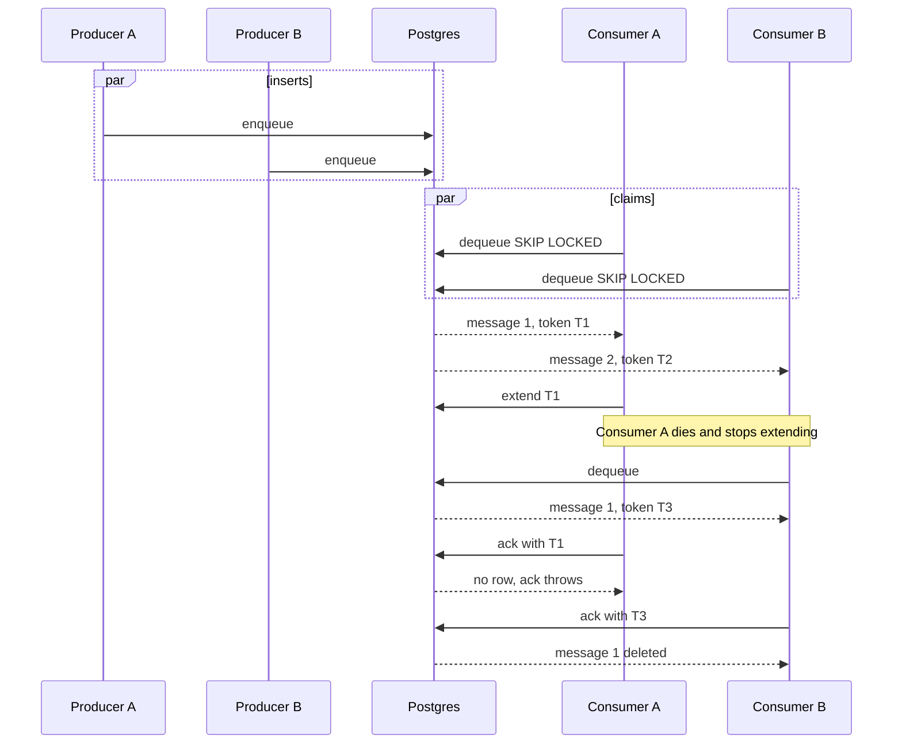

# Background Worker Producer-Consumer Message Queue

Parent designs:
[Background Workers Isolation and Scaling](./BackgroundWorkers.md) (high-level),
[detailed design](./BackgroundWorkersSplit.md)
([RHSTOR-8954](https://redhat.atlassian.net/browse/RHSTOR-8954),
[RHSTOR-9447](https://redhat.atlassian.net/browse/RHSTOR-9447)).

Measured implementation (branch `romy-objects-reclaimer-mq`,
`docs/design/message-queue.md` on that branch): the objects reclaimer is the
first caller. That branch ran the same three Postgres backends through one
pull API, with many producer processes and many consumer processes.

This document is the **queue** sub-design for the split. It keeps that
measured contract. The queue must be safe with **many producer pods and many
consumer pods** at once. Pod counts, sharding, and task weights live in the
parent design.

### Table of Contents

* [Introduction](#introduction)
* [Glossary](#glossary)
* [Goals](#goals)
* [In Scope](#in-scope)
* [Out of Scope](#out-of-scope)
* [What the reclaimer branch measured](#what-the-reclaimer-branch-measured)
* [Broker Comparison](#broker-comparison)
  * [How to read the scores](#how-to-read-the-scores)
  * [Feature fit](#1-feature-fit)
  * [Deployment and licensing](#2-deployment-and-licensing)
  * [CVE and security-update ownership](#3-cve-and-security-update-ownership)
  * [Multiple producer pods and multiple consumer pods](#4-multiple-producer-pods-and-multiple-consumer-pods)
  * [Feasibility and effort](#5-feasibility-and-effort)
  * [Weighted scorecard](#6-weighted-scorecard)
  * [Side-by-side](#side-by-side)
* [Feature Technical Details](#feature-technical-details)
  * [Proposed architecture](#proposed-architecture)
  * [General interface](#general-interface)
  * [pg-boss changes required](#pg-boss-changes-required)
  * [Dummy worker](#dummy-worker)
  * [Configuration](#configuration)
  * [Retry and terminal semantics](#retry-and-terminal-semantics)
  * [Per-option notes](#per-option-notes)
  * [Performance](#performance)
  * [Scalability](#scalability)
  * [Availability / High Availability](#availability--high-availability)
  * [Concurrency / Race Conditions](#concurrency--race-conditions)
  * [Tradeoffs](#tradeoffs)
  * [DB schema changes](#db-schema-changes)
  * [API changes](#api-changes)
  * [CRD changes](#crd-changes)
* [Affected Components](#affected-components)
* [Limitations](#limitations)
* [Dependencies](#dependencies)
* [Effort Estimation](#effort-estimation)
* [Recommended Decision](#recommended-decision)
* [Open Questions](#open-questions)
* [Summary table](#summary-table)

---

## Introduction

Today NooBaa background work is a set of in-process pollers registered in
`src/server/bg_workers.js` through `Background_Scheduler`. Each worker
wakes on a timer, queries PostgreSQL, does the work, and sleeps. Produce and
consume are the same loop. A second copy of that process would scan the same
rows.

The parent design runs discovery and execution as **separate Deployments**.
`producer.replicaCount` and `consumer.replicaCount` can both be greater than 1.
The queue is the handoff those pods share:

1. Every producer pod may insert at the same time. Inserts do not update the same row.
2. Every consumer pod may claim at the same time. `SKIP LOCKED` gives each pod a different row.
3. A claim carries a **lock token**. `ack`, `nack`, and `extend` succeed only when that token still owns the row. A late ack from a pod that lost the claim throws and leaves the new owner's row alone.
4. A live consumer **extends** the claim while the batch runs. A dead consumer stops extending. Another pod claims the message after the visibility timeout.
5. A claim that already used its last attempt comes back as **terminal**. The caller drops it and does not run the batch again.

Branch `romy-objects-reclaimer-mq` implemented that contract three ways and
benchmarked them. The home-grown table meets it directly. pg-boss meets it
only after the adapter changes in [pg-boss changes required](#pg-boss-changes-required).
Graphile meets it only by writing `_private_jobs`, which is not a supported
API, and its own `completeJob` deletes by id with no token.

NooBaa already runs **PostgreSQL 15** (`quay.io/sclorg/postgresql-15-c9s`) and
**Node.js 24.13** (`.nvmrc`). The queue stays on that Postgres. External
brokers stay out of this design.

---

## Glossary

| Term | Meaning |
|------|---------|
| **Producer pod** | A replica of the BG producer Deployment. Calls `enqueue`. Does not claim. |
| **Consumer pod** | A replica of the BG consumer Deployment. Calls `dequeue`, `extend`, `ack`, and `nack`. |
| **Claim** | One `dequeue` that locks a message until `ack`, `nack`, or the visibility timeout. |
| **Lock token** | Value minted by `dequeue` and required by `ack`, `nack`, and `extend`. The next claim of the same message gets a new token. On pg-boss this is the fetched `retryCount`, passed back into `deleteJob` / `fail`. |
| **Visibility timeout** | How long a claim stays invisible. Default 10 minutes (`MESSAGE_QUEUE_VISIBILITY_MS` on the reclaimer branch). |
| **`extend`** | Slides that deadline forward while this pod is still processing. Postgres moves `locked_until`. pg-boss must rewrite `started_on` (see below). |
| **Terminal message** | A claim that already used its last attempt and then expired. The caller nacks it and does not run the batch. |
| **Dead row** | Home-grown row with `dead_at` set. `size` and `dequeue` skip it. It records why the batch stopped. Kept 7 days. |
| **Queue name** | One logical queue per background worker, stored as a column. Workers do not claim each other's rows. |
| **SKIP LOCKED** | PostgreSQL row lock mode. Concurrent consumer pods take different rows and do not wait on each other. |
| **pg-boss** | Job queue library, npm `pg-boss` 12.36.0 on the reclaimer branch. Usable here only with the fenced pull adapter. |
| **Graphile Worker** | Job queue library, `graphile-worker` 0.16.6 on that branch. The public worker API does not expose a fenced pop. |
| **NC** | Non-containerized NooBaa. This queue is unused when there is no Postgres. |

---

## Goals

* One pull interface for every producer pod and every consumer pod: `enqueue`, `dequeue`, `ack`, `nack`, `extend`.
* **N producer pods** insert concurrently. Two inserts do not collide on one row.
* **M consumer pods** claim concurrently. Two pods do not hold the same message under two tokens.
* A pod that lost its token cannot delete or complete the claim another pod now holds.
* A pod that is still running keeps the claim by extending it, including batches longer than the original visibility window.
* A crash on the last attempt returns a terminal message so the caller can release its own marker (the reclaimer releases `reclaim_enqueued_at`).
* Stay on the existing Postgres. No second stateful service.

---

## In Scope

* The pull API and the home-grown table as the client to run.
* The pg-boss adapter **with** fenced settle, `started_on` extend, and the terminal extra fetch. Without those, pg-boss is not a candidate.
* Graphile recorded as measured and rejected for this API.
* Multi-process tests already on the reclaimer branch: one producer and one consumer, many of each, stale ack after a second claim, extend past the original lock, terminal drop after the last attempt.
* `config.js` knobs for type, visibility, max attempts, and retry delay.

---

## Out of Scope

* Stock pg-boss `work()` / `touch()` / `deleteJob(id)` with no `retryCount`. That path deletes whichever row currently has the id.
* Graphile `completeJob` and any new writes to `_private_jobs`.
* A separate dead-letter table, priority, singleton keys, and per-message backoff curves. The reclaimer branch left these out. The caller's own marker (`reclaim_enqueued_at`, and the equivalent on later workers) is what stops a second scan from enqueueing the same objects while a claim is live.
* A heartbeat column. `extend` rewrites the lock deadline.
* External brokers: RabbitMQ, NATS, Kafka / AMQ Streams, PGMQ.
* Exactly-once processing. Delivery is at least once. A batch can run twice if the pod dies after it has started and then stops calling `extend`.
* NC (`DB_TYPE=none`).
* A product UI for dead rows.

---

## What the reclaimer branch measured

`src/tools/message_queue_bench.js` on `romy-objects-reclaimer-mq`. Local
Postgres, 2000 messages, 128-byte payload, concurrency 4, pool 15. The live
case is 5 pushers and 10 poppers. Each number is the average of two runs
with the backend order reversed. This is the success path: one insert, one
locked update, one delete. `extend` and the terminal handoff are not on that
path.

**Fill, then drain**

| Client | Enqueue ops/s | p50 ms | p99 ms | Drain ops/s | p50 ms | p99 ms | Dequeue p50 | Ack p50 |
| --- | ---: | ---: | ---: | ---: | ---: | ---: | ---: | ---: |
| postgres | 6360 | 0.44 | 6.34 | 2700 | 1.30 | 4.88 | 0.87 | 0.42 |
| graphile | 4550 | 0.70 | 3.17 | 2900 | 1.23 | 4.28 | 0.88 | 0.33 |
| pg-boss | 3770 | 0.82 | 4.41 | 3070 | 1.08 | 4.83 | 0.59 | 0.47 |

**5 pushers and 10 poppers at the same time**

| Client | Push ops/s | p50 ms | p99 ms | Pop ops/s | p50 ms | p99 ms | Dequeue p50 | Ack p50 |
| --- | ---: | ---: | ---: | ---: | ---: | ---: | ---: | ---: |
| postgres | 5350 | 0.73 | 3.53 | 3940 | 2.31 | 10.21 | 1.27 | 0.95 |
| graphile | 2630 | 1.42 | 7.63 | 2620 | 1.93 | 7.10 | 1.07 | 0.82 |
| pg-boss | 2330 | 1.89 | 6.73 | 2330 | 2.61 | 9.69 | 1.35 | 1.17 |

Postgres enqueue is one insert into a narrow row and one partial index.
Graphile `add_job` and pg-boss `send` maintain more indexes on every insert
and delete. Drain is closer: all three are a `SKIP LOCKED` claim plus a
delete. pg-boss had the fastest staged drain and the slowest live overlap.
The objects reclaimer caps depth at 8 messages of 100 object ids, so at that
depth the queue is not the bottleneck. Archive and map deletion are. The
live numbers still matter once more workers and more pods share the table.

Correctness on that branch, after the fencing fixes:

| | Home-grown | pg-boss, after the adapter changes | Graphile, after private SQL |
|---|---|---|---|
| Two pods dequeue one queue | Different rows (`SKIP LOCKED`) | Different rows (`fetch`) | Different rows, only if jobs have no Graphile queue name |
| Late ack after another pod claimed | Throws. `lock_token` mismatch | Throws, if settle passes `{ id, retryCount }` | Throws, if settle matches `locked_by`. `completeJob` would not |
| Live pod keeps a long batch | `extend` moves `locked_until` | `extend` rewrites `started_on`. `touch()` does not | `extend` moves `locked_at` via private SQL |
| Crash on the last attempt | Next dequeue returns `terminal`. `nack` sets `dead_at` | Fetched once more with `attempts` above the max. Caller must delete it | Private SQL can delete it. A perma-failed row is otherwise stuck |
| Public API enough? | Yes. The table is ours | Yes, with the three changes below | No. `_private_jobs` is internal to 0.16 |

---

## Broker Comparison

### How to read the scores

Scores are 1–5 (5 is best) for a pull queue on the existing Postgres, with
many producer pods and many consumer pods. The reclaimer branch is the
evidence. A library feature that the pull adapter cannot use does not score.

| Weight | Criterion | Why it matters here |
|--------|-----------|---------------------|
| 20% | Multiple producer pods and multiple consumer pods | Fenced claim, extend, and a terminal handoff across pods. |
| 15% | Minimal deployment | No new stateful service. |
| 15% | Retry and terminal drop | Last attempt must come back to the caller. A separate DLQ table is not required. |
| 15% | CVE / who patches the queue engine | Our SQL, or an npm we bump. Not a vendored engine, and not a private schema we patch by hand. |
| 10% | Pull interface | `enqueue` / `dequeue` / `ack` / `nack` / `extend` with a token. A handler loop that settles inside the library hides the token. |
| 10% | Open source / RH image | Our code or MIT, on the Postgres image we already ship. |
| 10% | Node.js / codebase fit | CommonJS, Node 24.13, existing `pg` client. |
| 5% | Implementation effort | Higher means less work left. The home-grown client and the pg-boss fence already exist on the reclaimer branch. |

---

### 1. Feature fit

| | **Homegrown Postgres queue** | **pg-boss (with the adapter changes)** | **Graphile Worker** |
|---|---|---|---|
| Produce | `INSERT` into `nb_message_queue`. Any pod. | `send()`. Any pod. No worker running on that pod. | `addJob()`. Slower than the single insert. |
| Consume | `UPDATE ... FOR UPDATE SKIP LOCKED`, returns `lock_token`. | `fetch()`, returns `retryCount` as the token. Do not use `work()`. | No supported pop. The branch reads `_private_jobs` and mints `locked_by`. |
| Ack | `DELETE` where `lock_token` matches. Throws if it matches nothing. | `deleteJob(queue, id, { retryCount })`. A bare id deletes the current row, including the next pod's claim. | Private `UPDATE`/`DELETE` where `locked_by` matches. `completeJob` is `DELETE WHERE id = $1` for a job with no queue name. |
| Nack | Visible again after `attempts * retry delay`, or `dead_at` when attempts are exhausted. Same token check. | `fail` with `{ id, retryCount }` while attempts remain. Dropping nack is `deleteJob` with the same fence. | Private SQL. A perma-failed job is excluded from the library's own dequeue. |
| Extend | `locked_until = now() + visibility`. Returns false when the token is gone. | Rewrite `started_on` and `heartbeat_on` to `now()` on that attempt. Expiry is `started_on + expireInSeconds`. `touch()` does not move it. | Rewrite `locked_at` on `_private_jobs`. |
| Visibility | `locked_until`. We set it. Default 10 minutes on the reclaimer. | `expireInSeconds`, clamped to **1s–24h**. Cannot be turned off. | Our dequeue treats a lock older than the visibility timeout as free. Graphile's own `resetLockedAt` still uses a **hardcoded 4 hours**. Both can expose a row. The token still rejects the old ack. |
| Terminal | Dequeue of an expired last attempt sets no new attempt count and returns `terminal: true`. | A crash on the last attempt is **fetched once more**, with `attempts` above the max. The caller treats that as terminal. An explicit nack on the last real attempt deletes immediately and does not cause that extra fetch. | Reachable only through the private SQL. |
| Competing consumers | One `queue_name`, many pods. | `standard` queue, many `fetch` callers. | A Graphile **queue name** runs one job at a time for the whole cluster. The branch leaves that name unset. |
| At-least-once | Yes. | Yes. The supervisor reclaims a dead worker on its next pass (about every 60s) after the deadline, not at the instant the deadline passes. | Yes, once the private dequeue agrees with the 4 hour unlock. |

---

### 2. Deployment and licensing

| | **Homegrown** | **pg-boss** | **Graphile** |
|---|---|---|---|
| Extra pod | None | None | None |
| Postgres | Existing NooBaa 15 | Same. Schema `nb_pgboss` on the branch (library default is `pgboss`) | Same. Schema `graphile_worker` |
| Install | SQL next to the client. Connect runs `CREATE` / `ALTER` / index statements | `pg-boss` 12.36.0. `start()` migrates under an advisory lock and starts the supervisor | `graphile-worker` 0.16.6. `migrate()` at connect |
| Pool | Shares the system-store pool (10). Object metadata uses the separate `md` pool. Same Postgres instance, so WAL and autovacuum are shared | Its own pool, 4 on the branch. Twenty pods add 80 connections, plus supervisor queries | Its own pool, 4 on the branch |
| Open source | NooBaa | MIT, one maintainer, major 12 | MIT |
| Node | No new dependency | ESM. `require` works on Node 22.12+. We run 24.13 | ESM. Plus a dependency on private SQL that can break on a library bump |
| CVE owner | Us, for this table | Upstream, if we stay on the public fenced API | Us in practice, because the client patches `_private_jobs` |
| Minimal-deployment score | **5** | **5** | **5** |

---

### 3. CVE and security-update ownership

| | **Homegrown** | **pg-boss** | **Graphile** |
|---|---|---|---|
| What we ship | `nb_message_queue` and the pop / fence / extend SQL | npm + `nb_pgboss` | npm + writes to an internal schema |
| Who patches a queue bug | We do, in code we wrote | We bump `pg-boss`, and we keep the three adapter changes | A library bump can invalidate `_private_jobs`. We would re-test private SQL we do not own |
| Postgres CVEs | Stay on the sclorg image | Same | Same |
| Score | **3** | **4** | **2** |

Graphile's score is 2 because the working adapter is not "bump the npm". It is SQL against tables the project tells callers not to use.

---

### 4. Multiple producer pods and multiple consumer pods

```
producer pod 0 ──enqueue──┐
producer pod 1 ──enqueue──┼──►  nb_message_queue  ──►  consumer pod 0
producer pod N ──enqueue──┘      SKIP LOCKED            consumer pod 1
                                  one token each         consumer pod M
```



| Requirement | **Homegrown** | **pg-boss with the changes** | **Graphile** |
|-------------|---------------|------------------------------|--------------|
| Many pods enqueue | Inserts. No shared row | `send`. No shared row | `add_job`. No shared row |
| Many pods dequeue | `SKIP LOCKED` | `fetch` / `SKIP LOCKED` | `SKIP LOCKED` only with no Graphile queue name, via private SQL |
| Late ack | Token mismatch throws | `{ id, retryCount }` mismatch leaves the new attempt | `locked_by` mismatch throws. `completeJob` would delete the new attempt |
| Long batch | `extend` | Rewrite `started_on` | Rewrite `locked_at` on a private table |
| Dead consumer | Next dequeue after `locked_until` | Next `fetch` after `started_on + expireInSeconds`, observed by the supervisor (about 60s) | Our visibility SQL, and also Graphile's 4 hour `resetLockedAt` |
| Dead producer | Other pods keep inserting | Same | Same |
| Connections at scale | One shared pool of 10 in the process | +4 per process | +4 per process |
| Multi-pod score | **5** | **4** | **2** |

Homegrown is 5 because this is the path the branch tests: token, extend, terminal, many pushers, many poppers.

pg-boss is 4 because the same tests pass **after** the fence, the `started_on` extend, and the terminal extra fetch. The supervisor does not notice a dead pod until its next pass. Each pod also opens a pool the home-grown client does not.

Graphile is 2 because the tests pass only on private SQL, `completeJob` is unfenced, and the 4 hour unlock races our visibility timeout.

**Connection budget.** Home-grown statements borrow the system-store pool. A tight dequeue loop in a process that also serves system-store RPC shares those 10 connections. The reclaimer is paced (depth 8, batch delay 100 ms), so this is quiet for that worker. More consumer pods on the same pool is the limit to watch. pg-boss and Graphile add a pool per process on top of the NooBaa pools: `replicas × 4` plus supervisor queries, on the same Postgres as object metadata.

**Queue names.** The ready index starts with `queue_name`. A replication consumer does not lock an objects-reclaimer row. Every consumer pod for one worker competes on that one name.

**Depth cap.** The reclaimer's cap is check-then-act: each producer reads `size` and then inserts. Several producers can all pass the cap in the same moment. Depth goes up. Rows are not corrupted.

---

### 5. Feasibility and effort

| Option | As the client to run | Why |
|--------|----------------------|-----|
| **Homegrown Postgres** | **High** | The pull API, the token, extend, and the terminal drop are already the table. Success path is one insert, one locked update, one delete. |
| **pg-boss** | **Medium** | Works for the same tests once settle is fenced, extend rewrites `started_on`, and a post-max fetch is treated as terminal. Slower enqueue, extra pool, supervisor delay. |
| **Graphile** | **Low** | The public API cannot fence or extend. The branch's working client depends on `_private_jobs`. |

---

### 6. Weighted scorecard

| Criterion (weight) | Homegrown Postgres | pg-boss with the changes | Graphile Worker |
|--------------------|:------------------:|:------------------------:|:---------------:|
| Multiple producer and consumer pods (20%) | 5 | 4 | 2 |
| Minimal deployment (15%) | 5 | 5 | 5 |
| Retry and terminal drop (15%) | 5 | 4 | 2 |
| CVE / queue-engine patch owner (15%) | 3 | 4 | 2 |
| Pull interface (10%) | 5 | 3 | 2 |
| OSS / RH image (10%) | 5 | 5 | 5 |
| Node.js / codebase (10%) | 5 | 4 | 3 |
| Effort (5%) | 4 | 3 | 2 |
| **Weighted total (max 5)** | **4.65** | **4.10** | **2.85** |

Arithmetic:

* Homegrown: `(0.20×5) + (0.15×5) + (0.15×5) + (0.15×3) + (0.10×5) + (0.10×5) + (0.10×5) + (0.05×4) = 4.65`
* pg-boss: `(0.20×4) + (0.15×5) + (0.15×4) + (0.15×4) + (0.10×3) + (0.10×5) + (0.10×4) + (0.05×3) = 4.10`
* Graphile: `(0.20×2) + (0.15×5) + (0.15×2) + (0.15×2) + (0.10×2) + (0.10×5) + (0.10×3) + (0.05×2) = 2.85`

---

### Side-by-side

| | **Homegrown** | **pg-boss with the changes** | **Graphile** |
|---|---|---|---|
| Where it lives today | `postgres_message_queue.js` on `romy-objects-reclaimer-mq` | `pgboss_message_queue.js` on that branch | `graphile_message_queue.js` on that branch |
| Token | `lock_token` column | `retryCount` from `fetch` | `locked_by` written by us |
| Extend | `locked_until` | `started_on` (not `touch()`) | `locked_at` on `_private_jobs` |
| Dead letter | `dead_at` on the same row, skipped by the ready index, deleted after 7 days | Delete on terminal. Extra fetch when the supervisor expires the last attempt | Delete through private SQL |
| Live 5×10 push | 5350 ops/s | 2330 ops/s | 2630 ops/s |
| Run it? | **Yes** | Only with the three changes. Keep it for comparison | No |

---

## Feature Technical Details

### Proposed architecture

```
         MESSAGE_QUEUE_TYPE = postgres | pgboss

  producer pod 0 ─┐                         ┌─ consumer pod 0
  producer pod 1 ─┼─ enqueue(queue, payload)
  producer pod N ─┘         │               │
                            ▼               │  dequeue → token
                    ┌───────────────┐       │  extend(token)
                    │ MessageQueue  │◄──────┘  ack / nack (token)
                    │ pull client   │
                    └───────┬───────┘
                            │
                 postgres: nb_message_queue
                 pgboss:   nb_pgboss, fenced fetch
                            │
                     existing Postgres 15
```

`graphile` stays loadable on the comparison branch. This design does not
select it.

* A **producer** pod only calls `enqueue`.
* A **consumer** pod calls `dequeue`, then `extend` on a timer of half the visibility timeout (at least one second) for the whole batch, then `ack` or `nack` with the same token.
* Replica 1 uses the same calls as replica N. There is no single-pod path that skips the token.

Later workers use one queue name each (replication, lifecycle, db cleaner, agent blocks reclaimer). They are not wired in the reclaimer branch. The API already isolates them by `queue_name`.

| Today | After the split |
|-------|-----------------|
| Objects reclaimer finds unreclaimed objects and deletes them in one loop | Producer pods enqueue batches of object ids. Consumer pods claim, extend while deleting, ack. Terminal nack releases `reclaim_enqueued_at`. This is what the branch does. |
| Other object-handling loops find and execute together | Same handoff, one queue name per worker, once that worker has its own marker for "already enqueued". |

---

### General interface

The reclaimer branch's client is the interface. Names below match it.

| Method | Behavior |
|--------|----------|
| `connect()` | Creates the backend schema if needed. Safe to call more than once. |
| `disconnect()` | Closes the pg-boss pool. The home-grown client uses the shared NooBaa pool and does not close it. |
| `enqueue(queue, payload)` | Inserts one JSON object. Returns the message id. |
| `dequeue(queue)` | Locks one visible message and returns it, or `null`. |
| `size(queue)` | Count of live messages, including ones currently locked. Dead rows are excluded. |
| `ack(message)` | Removes the message. Throws if this token no longer owns it. |
| `nack(message, reason)` | `{ dropped: false }` and a delay of `attempts * MESSAGE_QUEUE_RETRY_DELAY_MS`, or `{ dropped: true }` at max attempts. Throws if this token no longer owns it. |
| `extend(message)` | Pushes the visibility deadline forward. Returns `false` when this claim is gone. |

`dequeue` returns `id`, `queue`, `payload`, `attempts` (1 on the first claim), the token (`lock_token` or `retry_count`), and `terminal`.

`hold_lease(queue, message)` on the shared client runs `extend` on that timer. The caller stops the timer when the batch finishes. `is_terminal_message(message)` is how every worker decides to drop instead of run. pg-boss can report `attempts` **past** the max on the extra fetch after a crash, so the terminal check allows that.

Do not add a `run_consumer(handler)` that acks inside the library. That is `work()`, and it is how a late completion deletes another pod's claim.

---

### pg-boss changes required

These are the changes already on `romy-objects-reclaimer-mq`. pg-boss is in the comparison only with all three. Shipping `work()`, `touch()`, or `deleteJob(queue, id)` puts it back in the "does not fit" column.

1. **Fence the settle.** `dequeue` is `fetch`. `ack` and a dropping `nack` call `deleteJob(queue, id, { retryCount })`. A retrying `nack` calls `fail` with the same object. pg-boss then matches the active attempt that was fetched. A plain id becomes `DELETE WHERE name = $1 AND id = $2` and removes the row a second pod has since claimed.
2. **Extend by moving `started_on`.** The library expires a job at `started_on + expireInSeconds`. `touch()` refreshes a heartbeat and leaves that deadline where it was. The adapter sets `started_on` and `heartbeat_on` to `now()` for the active attempt identified by `retryCount`. A pod that is still working is not overtaken at 10 minutes. A pod that dies stops extending, and the deadline stops moving.
3. **Treat the extra last fetch as terminal.** Supervisor retry uses `retryDelay: 0`. A crash on the last attempt is fetched once more, with `attempts` greater than `MESSAGE_QUEUE_MAX_ATTEMPTS`. The caller nacks (deletes) it and does not run the batch. An explicit `nack` on the last real attempt deletes immediately and does not cause that extra fetch. The delay from `_nack_later` applies only to an explicit nack.

Also set `expireInSeconds` from `MESSAGE_QUEUE_VISIBILITY_MS`. The library clamps it to between 1 second and 24 hours. `schedule: false` does not turn the supervisor off. Every process that called `start()` runs it, about once a minute, so a dead worker is reclaimed on that pass after the deadline.

---

### Dummy worker

The objects reclaimer on the branch is the first real caller, so a dummy is not required to prove the queue. If a dummy is still useful before the next worker:

| Worker | Role |
|--------|------|
| `mq_dummy_producer` | `enqueue('dummy', { ts, seq })` on its timer. |
| `mq_dummy_consumer` | `dequeue`, `hold_lease`, then ack or nack. A fail ratio exercises retry and the terminal drop. |

Success criteria, already the shape of the branch tests:

* Two producer processes inserting different payloads both insert.
* Two consumer processes never run the same in-flight id under two live tokens.
* `ack` with a token from a claim that has since been taken throws, and the new claim remains.
* `extend` keeps the row invisible past the original deadline. When extend stops, another process can dequeue it.
* A crash on the last attempt yields `terminal: true`. The next caller drops it and does not run the payload.
* Killing one producer does not stop the others.

---

### Configuration

Match the knobs already used on the reclaimer branch:

```javascript
config.MESSAGE_QUEUE_TYPE = process.env.MESSAGE_QUEUE_TYPE || 'postgres';
// postgres | pgboss | none
// graphile is not a supported selection for new workers

config.MESSAGE_QUEUE_VISIBILITY_MS = Number(process.env.MESSAGE_QUEUE_VISIBILITY_MS) || (10 * 60 * 1000);
config.MESSAGE_QUEUE_MAX_ATTEMPTS = Number(process.env.MESSAGE_QUEUE_MAX_ATTEMPTS) || 5;
config.MESSAGE_QUEUE_RETRY_DELAY_MS = Number(process.env.MESSAGE_QUEUE_RETRY_DELAY_MS) || 1000;
config.MESSAGE_QUEUE_PGBOSS_POOL_MAX = Number(process.env.MESSAGE_QUEUE_PGBOSS_POOL_MAX) || 4;
```

`parseInt(...) || default` treats `0` as unset, so these cannot be turned off by setting them to zero.

Pod role and ordinal stay in the parent design. The queue does not read them.

---

### Retry and terminal semantics

| Event | Behavior |
|-------|----------|
| Enqueue | A new row. Producers do not update an existing queue row. |
| Dequeue | One consumer locks one visible row, increments `attempts` on a fresh claim, mints a new token, sets the visibility deadline. |
| Extend | Same token only. Deadline becomes `now + MESSAGE_QUEUE_VISIBILITY_MS`. |
| Ack | Delete that token's row. |
| Nack with attempts left | Clear the lock, set `visible_at` to `now + attempts * MESSAGE_QUEUE_RETRY_DELAY_MS`. |
| Nack at max attempts | Home-grown: set `dead_at` and `last_error`, leave the row for 7 days, hide it from the ready index. pg-boss: fenced `deleteJob`. |
| Expired last attempt | Return `terminal: true` without running the batch. Caller nacks and releases its own marker. |
| Consumer crash | Extend stops. After the deadline, any consumer pod may dequeue. If that was the last attempt, the new dequeue is terminal. |
| Stale ack or nack | Throws. The caller must not clear its marker. The pod that holds the new token is the one that clears it. |
| Producer crash | Uncommitted insert disappears. Other producer pods keep going. |

---

### Per-option notes

#### Homegrown Postgres queue (the client to run)

Table `nb_message_queue`:

| Column | Role |
|--------|------|
| `id` | `bigserial` primary key. `dequeue` orders by it. |
| `queue_name` | Logical queue. |
| `payload` | `jsonb`. |
| `visible_at` | Not claimable before this time. `nack` pushes it forward. |
| `locked_until` | Claim deadline. `extend` sets it to `now()` plus the visibility timeout. |
| `attempts` | Incremented when a fresh claim is taken. A terminal reclaim does not increment it again. |
| `lock_token` | Current claim. Cleared on `nack`. |
| `last_error` | Last nack reason, or `visibility timeout` when the caller drops a terminal claim. |
| `dead_at` | Set by a dropping nack. The ready index omits these rows. |

Ready index: `(queue_name, visible_at, id) WHERE dead_at IS NULL`. Connect drops dead rows older than 7 days.

`dequeue` orders by `id`. The ready index leads with `visible_at`. At depth 8 that mismatch is noise. A deep backlog can sort the ready set instead of walking it in id order. A follow-up is an index that matches `ORDER BY id`.

There is no heartbeat column. Liveness is "this process keeps calling `extend`". A wedged process that still extends holds the batch until it exits.

Connect still runs `CREATE TABLE`, `ALTER TABLE`, `CREATE INDEX`, and `DROP INDEX` on later connects. Those lock `nb_message_queue`, not the object-metadata tables. Many pods booting together will serialize on that DDL. Prefer applying it once, then making connect a no-op when the table is already at the expected shape.

#### pg-boss

See [pg-boss changes required](#pg-boss-changes-required). Schema `nb_pgboss`, library 12.36.0. `send` and the partitioned job table are why enqueue and the live overlap are the slowest of the three.

Keep this adapter so the benchmark and the stale-ack tests still have a second backend. Do not make it the default unless the home-grown pool limit becomes the problem and we accept the extra connections and the supervisor delay.

#### Graphile Worker

Not selected.

The branch's client fences `ack` and `nack` with a per-claim `locked_by`, refreshes `locked_at` on extend, and can delete an expired last attempt. All of that is SQL on `_private_jobs`. The library's `completeJob`, for a job without a Graphile queue name, is `DELETE WHERE id = $1`. Switching to it would drop the fence. `resetLockedAt` unlocks rows older than 4 hours, hardcoded, in parallel with our visibility timeout. Enqueue on the live overlap ran at about half the Postgres rate. Each process opens a pool of 4 and runs `migrate()` at connect.

---

### Performance

Background rates are low beside the benchmark (the reclaimer holds 8 messages). The measured gap still shows up as soon as many pods push and pop together: home-grown live push is about **5350 ops/s**, pg-boss about **2330**, Graphile about **2630**, on one local Postgres with 128-byte payloads.

All three write the same Postgres as object metadata. Do not enqueue on the S3 request path. A large bucket should be a page of keys in one message, which is what the reclaimer already does (100 object ids per message).

---

### Scalability

* **Producer pods.** Concurrent inserts. Throughput of discovery is the scanner. The queue does not shard them.
* **Consumer pods.** Throughput ≈ min(ready messages, replica count × handler speed). `SKIP LOCKED` is what makes extra pods useful. Extend keeps a slow handler from being stolen.
* **Home-grown pool.** 10 system-store connections per process. That bounds how much dequeue a process can do next to system-store RPC. A dedicated queue pool is the follow-up if a worker outgrows that.
* **pg-boss pool.** 4 extra connections per process, so replica count hits `max_connections` first.
* **Hot queue.** One table, many `queue_name` values. The ready index starts with the name.

Replica count 1 uses the same SQL as replica N.

---

### Availability / High Availability

| | Behavior |
|---|----------|
| Postgres down | Queue is down. Bg workers already cannot run. |
| One producer pod down | That shard's discovery pauses. Other producer pods keep inserting. |
| One consumer pod down | Its extend loop stops. After the visibility window, another consumer takes the message. A late ack throws. |
| All consumer pods down | Rows sit until a consumer returns. Nothing is dropped because a consumer is gone. |
| pg-boss supervisor | Dead-worker reclaim waits for the next supervise pass, about 60 seconds, after the deadline. |
| Rolling update | Stop extending, ack or nack in-flight work, exit. The replacement pod dequeues what is visible. |

The home-grown client shares the system-store pool, so a stuck queue transaction in that process waits with system-store queries. pg-boss's pool dying does not take the metadata pool with it. That isolation costs the extra connections.

---

### Concurrency / Race Conditions

1. **Claim is atomic.** `FOR UPDATE SKIP LOCKED` or pg-boss `fetch`. Two pods do not receive the same row at the same instant.
2. **Settle is fenced.** The token from this dequeue is part of the `ack`, `nack`, and `extend` predicate. After a second claim, the first token changes nothing and the call throws.
3. **Extend vs steal.** A live pod slides the deadline. The overlap starts only after extend has stopped for one visibility window. Handlers can still run twice if the pod keeps working after the database has given the row away (partition, stalled event loop). Reclaim work has to tolerate a second run.
4. **Terminal drop.** The new pod does not execute a batch that already used its last attempt. It nacks and releases the caller's marker.
5. **Stale ack must not clear the marker.** The reclaimer clears `reclaim_enqueued_at` only when the owning ack or dropping nack succeeds. A thrown stale ack leaves the marker set for the pod that holds the new token.
6. **Producers do not dedupe inside the queue.** Two pods can insert two batches that name the same object if the caller's marker check races. The reclaimer uses `reclaim_enqueued_at` for that. A queue-level unique key is not in this design.
7. **`size` then `enqueue` can pass a depth cap** when several producers read the size together.
8. **DDL on connect** from many home-grown pods locks the queue table. Do that once.
9. **Graphile's two expiries.** Our visibility timeout and the library's 4 hour `resetLockedAt` can both expose a row. That is one reason Graphile is not selected.

---

### Tradeoffs

| Choice | Gain | Cost |
|--------|------|------|
| Home-grown table as the default | Token, extend, terminal, and the fastest enqueue and live overlap. No private schema | We own the SQL. Shared system-store pool. Dead rows for 7 days. Connect DDL |
| pg-boss with the three changes | Same tests pass. Library owns migrations. Its pool is separate from system-store | `retryCount` fence, `started_on` extend, and the extra last fetch must stay. Slower push. Supervisor lag. +4 connections per pod. One maintainer |
| pg-boss `work()` / `touch()` / unfenced `deleteJob` | Less adapter code | A late ack deletes the other pod's claim. `touch()` does not keep a long batch |
| Graphile public API | npm, `SKIP LOCKED` inside the library | No fenced pop. 4 hour unlock. Serial queue name |
| Graphile private SQL, as on the branch | Tests can pass | We track an internal schema. `completeJob` is unfenced. About half the live push rate |
| `extend` instead of a short fixed VT | A long reclaim is not stolen at 10 minutes | A wedged process that keeps the timer holds the message until it exits |
| Page-of-keys messages | The reclaimer already does this (100 ids) | The whole page must tolerate a second run |

**Default: the home-grown queue.** pg-boss is the optional second backend, and only with the adapter changes. Graphile is not a target.

---

### DB schema changes

* `MESSAGE_QUEUE_TYPE=postgres` (default): `nb_message_queue` as above. No second dead-letter table. No change to object-metadata tables. The reclaimer already has `reclaim_enqueued_at`; that marker is the caller's, not the queue's.
* `MESSAGE_QUEUE_TYPE=pgboss`: library schema `nb_pgboss`, created by `start()`.

---

### API changes

None on S3, RPC, or the public JSON schema. The queue client is internal.

---

### CRD changes

None here. Producer and consumer `replicaCount` are the parent design. Those counts are how the cluster runs multiple producer pods and multiple consumer pods.

---

## Affected Components

| Component | Change |
|-----------|--------|
| `src/util/message_queue_client.js` | Factory, pull API, `hold_lease`, `is_terminal_message`. On the reclaimer branch |
| `src/util/postgres_message_queue.js` | Home-grown table. The client to run |
| `src/util/pgboss_message_queue.js` | Fenced pg-boss adapter. Comparison, and the only way pg-boss is allowed |
| `src/util/graphile_message_queue.js` | Present on the comparison branch. Not selected |
| `src/server/bg_services/objects_reclaimer.js` | First caller. Enqueue, dequeue, `hold_lease`, terminal nack releases `reclaim_enqueued_at` |
| `src/server/bg_workers.js` | Connects the queue when the background process starts |
| `src/tools/message_queue_bench.js` | The numbers in this doc |
| `config.js` | `MESSAGE_QUEUE_*` |
| Later workers | One new queue name each, plus that worker's own "already enqueued" marker |
| `noobaa-operator` | No queue CRD. Replica counts are the parent design |

---

## Limitations

* At-least-once. A consumer that dies after starting the batch, and stops calling `extend`, has that batch run again after the visibility timeout.
* The owning ack clears `reclaim_enqueued_at` as soon as it commits. A second scan can enqueue those object ids while a crashed worker's partial deletes are still finishing.
* Several producers can pass the depth cap together.
* Dead home-grown rows younger than 7 days stay in the heap and the primary key. A poison batch that is dropped and scanned again inserts another dead row each cycle.
* Home-grown dequeue shares the system-store pool of 10.
* pg-boss, if enabled, still has the supervisor delay, the extra last fetch, and a pool per pod.
* The ready index does not match `ORDER BY id`. Fine at depth 8. Noisy if a queue grows deep.
* NC without Postgres cannot use the queue.
* The benchmark does not include `extend` or the terminal path.

---

## Dependencies

| Dependency | Required for default? | Notes |
|------------|-----------------------|--------|
| Existing PostgreSQL 15 | Yes | Same instance as the NooBaa database |
| `pg` / system-store pool | Yes | Home-grown client |
| `pg-boss` 12.36.0 | No | Only `MESSAGE_QUEUE_TYPE=pgboss`. Needs Node >= 22.12. `.nvmrc` is 24.13.0 |
| `graphile-worker` 0.16.6 | No | Comparison branch only |
| New container image | No | |

---

## Effort Estimation

The client, the three backends, the reclaimer wiring, the benchmark, and the unit tests are on `romy-objects-reclaimer-mq`.

| Work item | Size | Notes |
|-----------|------|--------|
| Land the home-grown client as the split's queue | S | Already written and tested for many producers and many consumers |
| Keep the fenced pg-boss adapter behind `MESSAGE_QUEUE_TYPE` | S | Do not drop the three changes |
| Drop Graphile from the default path | S | Leave the file only while the benchmark still needs it |
| Dedicated pool, ready index matching `ORDER BY id` | S–M | Follow-up if more workers share the table |
| Next worker (replication, lifecycle, cleaner) | M–L | New queue name and that worker's enqueue marker. Parent design |

---

## Recommended Decision

**Run the home-grown queue (`MESSAGE_QUEUE_TYPE=postgres`).**

It is the client whose public operations are the multi-pod contract: insert, `SKIP LOCKED` claim, `lock_token` on ack / nack / extend, and a terminal dequeue when the last attempt has already expired. On the measured 5-pusher / 10-popper run it is the fastest push and the fastest pop.

**pg-boss is acceptable only with the three adapter changes** on `romy-objects-reclaimer-mq`:

1. Settle with `{ id, retryCount }`, never a bare id.
2. `extend` rewrites `started_on`, because `touch()` does not move `started_on + expireInSeconds`.
3. A fetch with `attempts` above the max is terminal and is deleted, not executed.

Without those, pg-boss does not survive a second pod taking over a claim. With them, it passes the same fencing tests and loses on enqueue, connections, and how quickly a dead pod is noticed.

**Do not run Graphile.** The branch could only match the contract by writing `_private_jobs`. The library's own complete deletes by id, and a crashed job can sit until the hardcoded 4 hour unlock.

### Decision summary

| Rank | Option | Weighted | Role |
|------|--------|----------|------|
| 1 | **Homegrown Postgres** | **4.65** | **The client to run.** |
| 2 | pg-boss with the three changes | 4.10 | Optional comparison backend. Not the default. |
| 3 | Graphile Worker | 2.85 | Measured. Rejected. Private schema, unfenced `completeJob`, 4 hour unlock. |

---

## Open Questions

1. **Dedicated pool.** Should `nb_message_queue` use its own pool so a dequeue loop cannot wait behind system-store RPC in the same process?
2. **Ready index.** When a queue is deeper than the reclaimer's 8, should the index match `ORDER BY id`?
3. **Dead-row growth.** A poison batch that is dropped and scanned again inserts a new dead row every cycle. Is 7 days and a connect-time delete enough, or does the caller's marker need to stop that rescan?
4. **Next workers.** Replication, lifecycle, the db cleaner, and the agent blocks reclaimer each need a queue name and a depth cap. What marker plays the role of `reclaim_enqueued_at` for each?
5. **Second run.** Is a repeated reclaim batch safe for every archive and map-delete path, given that the owning ack clears `reclaim_enqueued_at` as soon as it commits?
6. **pg-boss stay or go.** Once the comparison is done, drop the dependency, or keep `MESSAGE_QUEUE_TYPE=pgboss` as an escape hatch if the shared pool of 10 becomes the limit?

---

## Summary table

| Name | Persists data on | TLS | Throughput, spikes, latency | DLQ, visibility timeout | Deployment size | Deployment way | Open source / Red Hat image | Total score | Multiple producer and consumer pods | Fits NC | Effort size |
|---|---|---|---|---|---|---|---|---|---|---|---|
| Homegrown Postgres queue | Postgres (`nb_message_queue`) | Yes, on the existing Postgres connection. | Measured: enqueue 6360 ops/s, drain 2700, live 5 pushers / 10 poppers push 5350 and pop 3940. One insert, one partial index. Spikes share WAL with object metadata. | `dead_at` on the same row (ready index skips it, delete after 7 days). `locked_until` default 10 minutes. `extend` slides it. `lock_token` fences ack, nack, and extend. | None. Shares the system-store pool of 10. | SQL in the home-grown client. Connect applies DDL today; that should become once-only. | NooBaa. Same Red Hat Postgres image. | **4.65 — run this** | Yes. Proven on the reclaimer branch: many inserters, many claimers, stale ack throws, extend holds a long batch, terminal drop on the last crashed attempt. | No. Needs Postgres. | Already on `romy-objects-reclaimer-mq`. |
| pg-boss with the three changes | Postgres (`nb_pgboss`) | Yes, on the existing Postgres connection. No listener of its own. | Measured: enqueue 3770, drain 3070 (fastest staged drain), live push 2330 and pop 2330. More indexes on insert and delete. | No separate DLQ in this adapter. Fenced `deleteJob` / `fail`. `expireInSeconds` clamped to 1s–24h. Extend moves `started_on`. Supervisor notices a dead pod about once a minute. A crash on the last attempt is fetched once more and must be treated as terminal. | None. Extra pool of 4 per process. Twenty pods add 80 connections, plus supervisor queries. | `pg-boss` 12.36.0. `start()` migrates and supervises. | MIT, one maintainer. Same Red Hat Postgres image. | 4.10 — optional, only with the fence, `started_on` extend, and terminal extra fetch | Yes, after those changes. `work()`, `touch()`, and `deleteJob(id)` fail the late-ack case. | No. Needs Postgres. Node >= 22.12. | Adapter is on the same branch. |
| Graphile Worker | Postgres (`graphile_worker`, including `_private_jobs`) | Yes, on the existing Postgres connection. | Measured: enqueue 4550, drain 2900, live push 2630 and pop 2620. About half the home-grown live push rate. A Graphile queue name would cap the fleet at one job. | No separate DLQ. Private SQL can delete an expired last attempt. Library `completeJob` deletes by id and drops the fence. Crash unlock inside the library is 4 hours (`resetLockedAt`), while our dequeue also uses `MESSAGE_QUEUE_VISIBILITY_MS`. | None. Extra pool of 4 per process. `migrate()` at connect. | `graphile-worker` 0.16.6, plus SQL the library does not support. | MIT. Same Red Hat Postgres image. | 2.85 — do not run | Competing consumers only with no shared queue name, and only through `_private_jobs`. | No. Needs Postgres. | Written for the benchmark. Not a target. |
