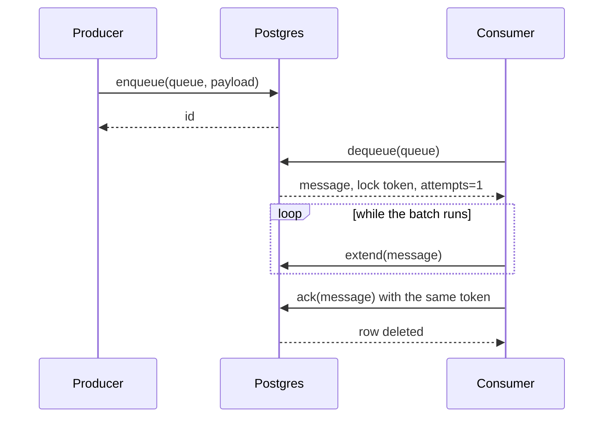
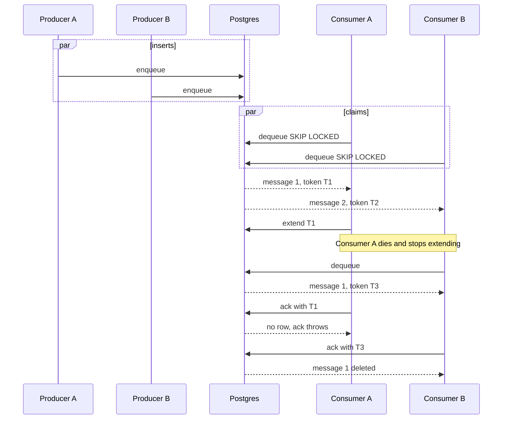

# Message Queue

Background workers on this branch share one pull-based queue. The objects reclaimer is the first caller. The same client can carry one queue name per worker (replication, lifecycle, db cleaner, agent blocks reclaimer) without those workers claiming each other's messages.

Three Postgres backends implement the same API. `MESSAGE_QUEUE_TYPE=postgres` is the one to run. Graphile and pg-boss stay in the tree so the benchmark and the fencing tests can compare them.

## Glossary

| Term | Meaning |
| --- | --- |
| Claim | One `dequeue` that locks a message for this worker until `ack`, `nack`, or the visibility timeout. |
| Visibility timeout | How long a claim stays invisible to other workers. Default 10 minutes (`MESSAGE_QUEUE_DEFAULT_VISIBILITY_MS`). |
| `extend` | Slides that timeout forward while the worker is still processing. |
| Lock token | Value minted by `dequeue` and required by `ack`, `nack`, and `extend`. A later claim of the same message gets a new token. |
| Terminal message | A claim that already used its last attempt and then expired. The caller drops it and does not run the batch again. |
| Dead row | Postgres document with `dead_at` set. `size` and `dequeue` skip it. It is the record of why the batch stopped. |
| Queue name | Logical queue. One name per background worker. Stored on the document. Every queue shares `nb_message_queue`. |

## Goals

- Let many processes push JSON batches and many other processes pop them, on the NooBaa Postgres database.
- A worker that lost its claim must not delete or complete the claim a second worker now holds.
- A worker that is still running must keep the claim by extending it.
- A crash on the last attempt must come back to the caller so the objects reclaimer can release `reclaim_enqueued_at`.
- Keep the success path to one insert, one `SKIP LOCKED` update, and one delete.

## In Scope

- `MessageQueueClient` and the `postgres`, `graphile`, `pgboss`, and `none` backends.
- The benchmark in `src/tools/message_queue_bench.js`.
- Objects reclaimer enqueue, dequeue, lease extension, and terminal drop.
- Fencing of `ack` and `nack` across processes.

## Out of Scope

- A second database for the queue. All three backends use the NooBaa Postgres instance.
- Priority, singleton keys, job groups, per-message backoff curves, and a separate dead-letter queue table.
- Heartbeat columns on the home-grown row. `extend` rewrites the existing lock deadline.
- Moving replication, lifecycle, the db cleaner, or the agent blocks reclaimer onto the queue. The API allows one queue name each. Those callers are not wired up here.

## API

`message_queue_client.instance()` returns one client per process, chosen by `MESSAGE_QUEUE_TYPE`. Each process has its own client. Processes coordinate only through rows in Postgres.

| Method | Behavior |
| --- | --- |
| `connect()` | Creates the backend schema if needed. Safe to call more than once. |
| `disconnect()` | Closes the graphile or pg-boss pool. The home-grown client uses the shared NooBaa pool and does not close it. |
| `enqueue(queue, payload)` | Inserts one JSON object. Returns the message id. `payload` must be a plain object. The queue name is 1–128 characters. |
| `dequeue(queue)` | Locks one visible message and returns it, or `null`. Uses `FOR UPDATE SKIP LOCKED` on Postgres and Graphile, and `fetch` on pg-boss. |
| `size(queue)` | Count of live messages, including ones currently locked. Dead and terminally failed rows are excluded. |
| `ack(message)` | Removes the message. Throws if this claim no longer owns it. |
| `nack(message, reason)` | Returns `{ dropped: false }` and makes the message visible again after `attempts * MESSAGE_QUEUE_DEFAULT_RETRY_DELAY_MS`, or `{ dropped: true }` when `attempts` has reached `MESSAGE_QUEUE_DEFAULT_MAX_ATTEMPTS`. Throws if this claim no longer owns it. |
| `extend(message)` | Pushes the visibility deadline forward. Returns `false` when this claim is gone. |

`dequeue` returns:

| Field | Meaning |
| --- | --- |
| `id` | Message id. The same id comes back when the message is claimed again. `ack`, `nack`, and `extend` take the whole message, not this id alone. |
| `queue` | Queue name. |
| `payload` | The JSON object that was enqueued. |
| `attempts` | 1 on the first claim. Incremented on each later claim. |
| `lock_token` | Postgres and Graphile. Required to settle that claim. |
| `retry_count` | pg-boss attempt counter from `fetch`. Required to settle that claim. |
| `terminal` | `true` when this claim already exhausted its attempts and the lock had expired. Do not run the batch. `nack` it. |

Configuration:

| Env | Default | Role |
| --- | --- | --- |
| `MESSAGE_QUEUE_TYPE` | `postgres` | `postgres`, `graphile`, `pgboss`, or `none` |
| `MESSAGE_QUEUE_DEFAULT_VISIBILITY_MS` | 600000 | Process default for claim lifetime. `extend` adds this much from now. |
| `MESSAGE_QUEUE_DEFAULT_MAX_ATTEMPTS` | 5 | Process default for when `nack` drops a message. |
| `MESSAGE_QUEUE_DEFAULT_RETRY_DELAY_MS` | 1000 | Process default delay before a nacked message can be claimed again, multiplied by `attempts`. |
| `MESSAGE_QUEUE_GRAPHILE_POOL_MAX` | 4 | Extra pool for the Graphile client. |
| `MESSAGE_QUEUE_PGBOSS_POOL_MAX` | 4 | Extra pool for the pg-boss client. |

`parseInt(...) || default` treats `0` as unset, so these knobs cannot be turned off by setting them to zero.

`hold_lease(queue, message)` and `is_terminal_message(message)` live on the shared client, so every background worker uses the same claim rules. `hold_lease` calls `extend` on a timer of half the visibility timeout (at least one second) and the caller stops that timer when the batch finishes. A terminal message is one the worker drops instead of running. The objects reclaimer nacks it and releases `reclaim_enqueued_at`. Another worker would nack it and release whatever claim its own payload represents.

## Database

The home-grown queue is the collection `nb_message_queue`. Connect creates it with `define_collection` from `src/util/message_queue_schema.js` and `src/util/message_queue_indexes.js`. The row is `_id char(24)` plus `data jsonb`, the same shape as the other collections. `_id` is a Mongo ObjectId. `dequeue` still claims one row with `FOR UPDATE SKIP LOCKED`, because the collection query API cannot express that. If a process still has the earlier typed table (column `id`), connect drops it once and creates the collection.

### Home-grown collection `nb_message_queue`

| Field | Role |
| --- | --- |
| `_id` | ObjectId primary key. `dequeue` orders by it, so order follows the ObjectId timestamp (one second), then the random bytes. |
| `queue_name` | Logical queue. |
| `payload` | JSON object stored by `enqueue`. |
| `enqueued_at` | Insert time. |
| `visible_at` | Not claimable before this time. `nack` pushes it forward. |
| `locked_until` | Claim deadline. `extend` sets it to `now()` plus the visibility timeout. Absent when the row is free. |
| `attempts` | Incremented when a fresh claim is taken. A terminal reclaim does not increment it again. |
| `lock_token` | Current claim. Removed on `nack`. |
| `last_error` | Last `nack` reason, or `visibility timeout` when the caller drops a terminal claim. |
| `dead_at` | Set by a dropping `nack`. Absent on a live row. |

Live index: `(data->>'queue_name', data->>'visible_at')` where `dead_at` is null, from `message_queue_indexes.js`. `define_collection` also adds the unique `_id` index. Connect deletes dead rows older than 7 days.

The home-grown client uses the default NooBaa pool (10 connections), which is the system-store pool. Object metadata uses the separate `md` pool. Queue statements and object-metadata statements still share one Postgres instance, so they share WAL, checkpoints, and autovacuum.

### Graphile

Schema `graphile_worker`, library 0.16.6. `enqueue` calls `addJob`. The queue name is the task identifier. Jobs are not given a Graphile `queue_name`, because that name runs one job at a time. `dequeue`, `ack`, `nack`, and `extend` are SQL on `_private_jobs`. `locked_by` is the per-claim token. The client opens its own pool.

### pg-boss

Schema `nb_pgboss`, library 12.36.0. `enqueue` is `send`, `dequeue` is `fetch`, `ack` and a dropping `nack` are `deleteJob`, a retrying `nack` is `fail`. Those settle calls pass `{ id, retryCount }` so pg-boss fences them to the fetched attempt. `extend` sets `started_on` and `heartbeat_on` to `now()` on that active attempt, because pg-boss expires a job from `started_on + expireInSeconds`. `touch()` alone does not move that deadline. The client opens its own pool and `start()` runs the supervisor (default every 60 seconds). `schedule: false` does not turn the supervisor off.

## Tools

`src/tools/message_queue_bench.js` compares the three backends on the NooBaa database.

```text
node src/tools/message_queue_bench.js \
  --type postgres,graphile,pgboss \
  --count 2000 --concurrency 4 --bytes 128 --producers 5
```

| Flag | Default | Meaning |
| --- | --- | --- |
| `--type` | `postgres,graphile,pgboss` | Backends, in the order they run. |
| `--count` | 1000 | Messages per scenario. |
| `--concurrency` | 4 | Parallel enqueue, then the same parallelism for the drain. |
| `--bytes` | 128 | Payload size. |
| `--producers` | 5 | Live scenario. Consumers are twice this number. |
| `--pool` | producers + consumers | Raises the Postgres, Graphile, and pg-boss pools to at least this size. |

Two scenarios run for each backend:

1. Fill, then drain. Enqueue `--count` messages at `--concurrency`, then dequeue and ack them at the same concurrency.
2. Live overlap. `--producers` processes push and `2 * --producers` processes pop at the same time. Pop latency is dequeue plus ack. Empty dequeues are not included. A consumer that sees an empty queue before the producers finish keeps polling.

The report columns are ops/s, p50, p99, and for drain and pop the dequeue p50 and ack p50. The process exits with an error if any message is left unacked or `size` is not 0.

## Performance

Measured on a local Postgres, 2000 messages, 128-byte payload, concurrency 4, pool 15. The live scenario is 5 pushers and 10 poppers. Each number is the average of two runs with the backend order reversed, so a warm cache does not only favor whichever client ran last.

This run is the success path: one insert, one locked update, one delete. `extend` and the terminal handoff are not on that path. The tables below are the jsonb collection. Graphile and pg-boss were measured in the same two runs.

**Fill, then drain**

| Client | Enqueue ops/s | p50 ms | p99 ms | Drain ops/s | p50 ms | p99 ms | Dequeue p50 | Ack p50 |
| --- | ---: | ---: | ---: | ---: | ---: | ---: | ---: | ---: |
| postgres | 7400 | 0.40 | 2.96 | 2200 | 1.76 | 3.98 | 1.23 | 0.51 |
| graphile | 5280 | 0.66 | 1.99 | 3320 | 1.15 | 2.36 | 0.82 | 0.32 |
| pg-boss | 4910 | 0.66 | 3.51 | 3760 | 0.93 | 3.59 | 0.50 | 0.41 |

**5 pushers and 10 poppers at the same time**

| Client | Push ops/s | p50 ms | p99 ms | Pop ops/s | p50 ms | p99 ms | Dequeue p50 | Ack p50 |
| --- | ---: | ---: | ---: | ---: | ---: | ---: | ---: | ---: |
| postgres | 5670 | 0.71 | 3.05 | 4000 | 2.38 | 6.37 | 1.35 | 0.96 |
| graphile | 3150 | 1.36 | 5.37 | 3140 | 1.83 | 6.86 | 1.05 | 0.77 |
| pg-boss | 2590 | 1.75 | 5.42 | 2580 | 2.11 | 7.44 | 1.03 | 0.98 |

On the earlier typed-column table, the same benchmark reported postgres enqueue 6360 and drain 2700, graphile 4550 and 2900, pg-boss 3770 and 3070. Live postgres was push 5350 and pop 3940, against graphile 2630 / 2620 and pg-boss 2330 / 2330. That machine was slower: Graphile and pg-boss are faster in this run too, so the absolute postgres enqueue gain (6360 to 7400) is the machine, not the document row. Postgres drain went the other way (2700 to 2200) while the other two drains got faster, and dequeue p50 went from 0.87 ms to 1.23 ms. The claim rewrites the whole `data` document. Enqueue is still the fastest of the three. pg-boss still has the fastest staged drain.

The objects reclaimer caps the queue at 8 messages of 100 object ids. At that depth the queue is not the bottleneck. Archive and map deletion are.

## Concurrency

`dequeue` takes one row with `FOR UPDATE SKIP LOCKED` (pg-boss `fetch` does the same kind of claim). Two callers do not receive the same row at the same instant. The interesting cases are a dead worker, and a worker that keeps running past the original deadline.

### One process enqueues, a second process dequeues



The producer never touches the claim. Its insert commits on its own. The consumer is the only process that can `ack`, `nack`, or `extend`, and only with the token from its `dequeue`.

If that consumer process is killed, it stops calling `extend`. After `locked_until` (or Graphile `locked_at`, or pg-boss `started_on + expireInSeconds`) the row is visible again. The next `dequeue` in a new process gets it with `attempts` incremented. If that was already the last attempt, `dequeue` returns `terminal: true`. The new process nacks, and the objects reclaimer clears `reclaim_enqueued_at`. The batch is not executed again.

`extend` from the dead process cannot succeed after the new process has claimed the row, because the token no longer matches.

### Many processes enqueue, many other processes dequeue



Producers only insert. A new ObjectId, Graphile `add_job`, and pg-boss `send` each create a new row. Two producers do not update the same queue row.

Consumers claim different rows. Consumer A's `ack` of token T1 changes nothing once Consumer B holds token T3, and the call throws. The objects reclaimer then tries `nack` with T1, that also throws, and `reclaim_enqueued_at` stays set. Consumer B's `ack` is the one that clears the claim.

While Consumer A is alive, its `extend` loop keeps message 1 invisible, so Consumer B does not take it. The overlap happens after `extend` has stopped for one visibility window.

Queue names keep workers apart. The live index starts with `queue_name`, so a replication consumer does not lock an objects-reclaimer row.

The reclaimer depth cap is check-then-act: each producer reads `size` and then inserts. Several producers can all pass the cap of 8 in the same moment. That raises depth. It does not corrupt a row.

## Issues with each backend

### postgres

This is the production client. `ack`, `nack`, and `extend` all require `lock_token`.

- Connect runs `define_collection`, which is `CREATE TABLE IF NOT EXISTS` and `CREATE INDEX` on `nb_message_queue`. The first connect after deploy builds the live index. Later connects still run those statements. They lock the queue table, not the object-metadata tables. A database that still has the typed table is dropped on that first connect.
- Every statement borrows the system-store pool of 10. A tight dequeue loop in a process that also serves system-store RPC shares those connections. The reclaimer is paced (queue depth 8, batch delay 100 ms), so this is quiet today.
- Dead rows stay until the 7-day delete on connect. A poison batch that is dropped and then scanned again inserts another dead row each cycle, because dropping the queue message releases `reclaim_enqueued_at` and the scanner may enqueue the same objects again.
- The live index is `(data->>'queue_name', data->>'visible_at')` where `dead_at` is null. `dequeue` orders by `_id` and compares `visible_at` as `timestamptz`, so the text index filters the queue and does not walk the claim in `_id` order. At depth 8 that mismatch is noise.
- There is no heartbeat column. Liveness is "this process keeps calling `extend`". A stuck process that still extends will hold the batch until it stops.

### graphile

`locked_by` is a per-claim token, and `ack` and `nack` throw when the update matches nothing. `extend` refreshes `locked_at`. An expired claim that has already reached `max_attempts` is returned with `terminal: true` and can be deleted by `nack`.

- The library's own `completeJob` for a job without a Graphile queue name is `DELETE WHERE id = $1`. This client does not use that statement. A future change that switches to it would drop the fence.
- Graphile's own worker unlocks rows whose `locked_at` is older than 4 hours (`resetLockedAt`). That interval is hardcoded. Our `dequeue` also treats a lock older than `MESSAGE_QUEUE_DEFAULT_VISIBILITY_MS` as free. Both can expose a row. The token fence still rejects the old worker's `ack`.
- The client writes `_private_jobs` directly. That schema is internal to graphile-worker 0.16.
- Each process opens a pool of 4 on top of the NooBaa pools, and `migrate()` runs at connect.
- Enqueue is `add_job`, which is slower than the single insert above. The live overlap in the benchmark ran at about half the Postgres rate.

### pg-boss

`deleteJob` and `fail` receive `{ id, retryCount }` from the `fetch` that claimed the job. A later attempt of the same id is left alone. `extend` rewrites `started_on` for that active attempt so the supervisor's `started_on + expireInSeconds` deadline moves with the worker.

- `expireInSeconds` is clamped to between 1 second and 24 hours. The visibility timeout cannot be turned off, and it cannot be shorter than one second.
- The supervisor runs in every process that called `start()`, about once a minute. A dead worker is reclaimed on that pass after the deadline, not at the instant the deadline passes.
- A crash on the last attempt is fetched once more, with `attempts` greater than `MESSAGE_QUEUE_DEFAULT_MAX_ATTEMPTS`. The reclaimer treats that fetch as terminal and deletes it. An explicit `nack` on the last real attempt deletes immediately and does not cause that extra fetch. Supervisor retry uses `retryDelay: 0`. The delay applied by `_nack_later` is only for an explicit nack.
- `send` and the partitioned job table maintain more indexes than the home-grown row. That is why enqueue and the live overlap are the slowest of the three.
- Each process opens a pool of 4. Twenty background pods add 80 connections, plus the supervisor queries, on the same Postgres as object metadata.

### none

`enqueue` returns `"0"`. `dequeue` returns `null`. `size` returns 0. `ack` and `nack` succeed without writing. `extend` returns `true`. Nothing is stored.

## Affected components

| Piece | Role |
| --- | --- |
| `src/util/message_queue_client.js` | Factory, the shared API, `hold_lease`, and `is_terminal_message`. |
| `src/util/postgres_message_queue.js` | Home-grown table. |
| `src/util/graphile_message_queue.js` | Graphile backend. |
| `src/util/pgboss_message_queue.js` | pg-boss backend. |
| `src/server/bg_services/objects_reclaimer.js` | Producer and consumer for `objects_reclaimer`. Uses `hold_lease`. On a terminal message, nacks and releases `reclaim_enqueued_at`. |
| `src/server/bg_workers.js` | Connects the queue when the background process starts. |
| `src/tools/message_queue_bench.js` | Comparison tool. |
| `config.js` | `MESSAGE_QUEUE_*`. |
| `package.json` | `graphile-worker` 0.16.6 and `pg-boss` 12.36.0. |

## Availability

The queue is up when Postgres is up. There is no second queue cluster and no leader election. A restarted consumer claims whatever the visibility timeout has made visible. A restarted producer inserts new rows. In-flight claims whose process died wait out the remainder of the visibility window, then another consumer takes them.

pg-boss and Graphile add a pool per process. Losing those connections does not take the object-metadata pool with them. The home-grown client shares the system-store pool, so a stuck queue transaction in that pool waits with system-store queries in the same process.

## Tradeoffs

The home-grown client is the one we ship. Its row is a jsonb document like the other collections, and claim lifetime, retry, and dead letters are code we own. The cost on the benchmark is the drain: the claim updates the whole document, and that path is slower than the typed-column table and slower than Graphile and pg-boss. Enqueue stays ahead of both.

Graphile and pg-boss bring a supervisor, migrations, and more indexes. They lost the multi-process `ack` race until this branch fenced the settle. They still cost extra connections and slower enqueue. They are kept so the benchmark and the stale-ack tests have something to compare against.

`extend` chooses "a live process keeps the batch" over "every batch is stolen at 10 minutes". A wedged process that keeps the timer running holds the message until the process exits.

## Limitations

- Delivery is at least once. A consumer that dies after it has started the batch, and stops calling `extend`, will have that batch run again after the visibility timeout. Reclaim work has to tolerate a second run.
- The objects reclaimer releases `reclaim_enqueued_at` when the owning `ack` or dropping `nack` succeeds. A second scan can enqueue those object ids while a crashed worker's partial deletes are still finishing on the pod that died.
- `size()` then `enqueue` can exceed `OBJECT_RECLAIMER_MAX_QUEUED_MESSAGES` when several producers scan together.
- Dead Postgres rows younger than 7 days remain in the heap and the primary key.

## Dependencies

- Postgres, same instance as the NooBaa database.
- `pg` for the home-grown client and for Graphile's pool.
- `graphile-worker` 0.16.6.
- `pg-boss` 12.36.0, which requires Node.js >= 22.12. This repo's `.nvmrc` is 24.13.0.

## Effort

The client, the three backends, the reclaimer wiring, the benchmark, and the unit tests are on branch `romy-objects-reclaimer-mq`. Follow-up work, if other background workers move onto this collection, is a dedicated pool, a claim index that matches `ORDER BY _id`, and a decision about whether Graphile and pg-boss stay once the comparison is done.

## Open questions

- Should the home-grown queue use a pool of its own so a dequeue loop cannot wait behind system-store RPC in the same process?
- When replication, lifecycle, the db cleaner, and the agent blocks reclaimer each get a queue name, what depth cap does each of them need?
- Is a second run of a reclaim batch safe for every archive and map-delete path, given that the owning ack clears `reclaim_enqueued_at` as soon as it commits?
